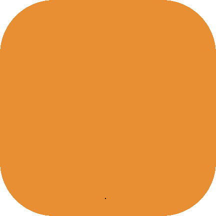

<h1 align="center">Silla CDP</h1>

|[Página Web](sillacdp.000webhostapp.com)|[Contáctenos](#contacto)|
|---|---|

<b>Lista de contenidos:</b>

<ol style="list-style-type:upper-roman">
<li><a href="#información-del-proyecto">Información del proyecto.</a></li>
<li><a href="#licencias">Licencias.</a></li>
<li><a href="#contacto">Contacto.</a></li>
</ol>

## Información del proyecto
**Silla CDP**, o *Silla Correctora de Postura* es un proyecto diseñado para **realizar** y **agilizar** la acción de **mantener una buena posición al encontrarse sentado**, en un contexto en el que pasar largos periodos de tiempo continuo haciéndolo sea una ocurrencia ordinaria.
Por lo tanto, presenta **características ergonómicas** que puedan otorgar **comodidad** y a la vez, **cuidado de la postura** del usuario.

Uno de los **principales fuertes** de la silla es su capacidad para **acomodarse automáticamente** a las medidas de cada usuario en particular. Mediante sensores de presión y el uso de motores, la silla es capaz de llevar a cabo un proceso de calibración que intenta ubicar las medidas óptimas para la persona, y luego, guardar esa configuración en memoria.

### **Entre sus otras características podemos encontrar:**
- Capacidad para varias configuraciones de usuarios.
- Fácil y rápido cambio de medidas en la silla al cambiar de un perfil de usuario a otro.
- Muestra de estados de los sensores y advertencia al detectar un posible error en la postura.
- Interfaz de usuario facil de interactuar, ya que está integrada con una pantalla táctil.

## Licencias

Los **iconos utilizados** en el proyecto fueron diseñados por [Freepik](https://www.freepik.com), desde [Flaticon](https://www.flaticon.es/). Para más información, visite [esta carpeta](./media/licenses) la cual contiene el archivo de la licencia.

**Este proyecto está distribuido bajo la licencia MIT**.

Para más informacion puede consultar [LICENSE](./LICENSE) o también este [enlace a Wikipedia](https://es.wikipedia.org/wiki/Licencia_MIT).

## Contacto
Puede contactar con nosotros mediante los siguientes correos electrónicos:

**Correo oficial del proyecto**: sillacdp@gmail.com

**Desarrolladores de Software**:
- *KEBERLEIN, Gian Franco*: gianfrancokeberlein@impatrq.com
- *AZULA, Facundo*: azulafacundo117@gmail.com